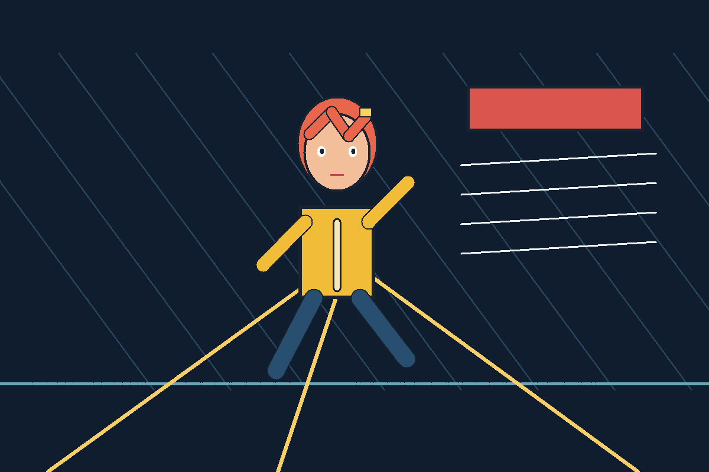
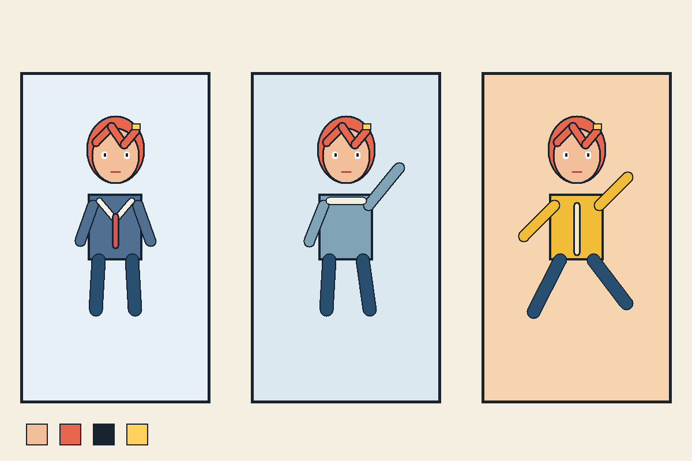
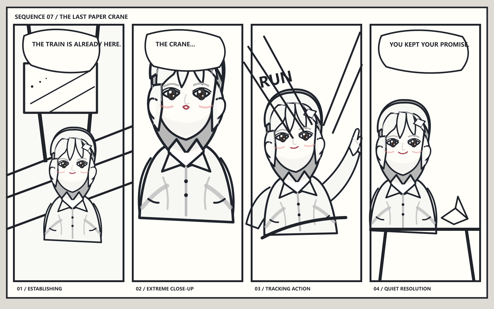

# Krita Anime Skill

基于 [`edithatogo/krita-cli`](https://github.com/edithatogo/krita-cli) 定制的 Krita 动漫绘制 CLI、HTTP 插件、MCP 服务和跨 Agent skill。

项目面向可编辑的精细化动漫生产，而不是只输出一张扁平图片。它把严格的 `AnimePlan` JSON 编译为受约束的 Krita 动作，支持原生笔刷引擎、压感笔划、线条稳定器、贝塞尔路径、SVG 矢量图层、分镜和角色一致性包。

## 主要能力

- 创建分层 `.kra` 动漫插画和故事板，并导出 PNG/JPG 预览。
- 使用 Krita 原生笔刷预设、压感笔划和稳定器完成线稿与上色。
- 使用贝塞尔路径和 SVG 矢量图层制作可编辑线条、形状和标注。
- 通过 character pack 固定脸型、眼睛、发型轮廓、比例、色板和标志物，再改变动作、表情、服装、镜头与场景。
- 让任意 Agent 后端模型共同遵守 `AnimePlan` 契约；模型负责理解 brief 和产出 JSON，schema、编译器和 Krita 插件负责验证与执行。

模型无关并不等于每个模型都能看图：纯文本后端需要用户提供 character pack 或可观察的人物特征；视觉模型可以先提取这些特征，再交给同一套 skill 工作流。

## 架构

```text
Agent backend (text / vision / local model)
                 |
                 v
        AnimePlan JSON contract
                 |
                 v
validator -> compiler -> bounded Krita actions
                              |
                              v
            CLI or MCP -> localhost HTTP bridge -> Krita plugin
                              |
                              v
                editable paint/vector/storyboard layers
```

## Demo 效果

这些 1600×1000 预览由 [`scripts/render_krita_demos.py`](scripts/render_krita_demos.py) 通过本项目的 HTTP bridge 实际控制 Krita 5.2.11 绘制和导出，没有使用生成式图像模型，也没有导入外部位图。人物的脸型、眼睛、发束、衣褶、赛璐璐阴影和高光均由确定性的贝塞尔造型构成，再由 Krita 内部的 Qt SVG 引擎渲染到独立 paint layer。每张图都同时保留了分层 `.kra` 源文件：



[打开分层 Krita 源文件](docs/demos/fine-lineart-scene.kra)



[打开角色一致性 Krita 源文件](docs/demos/character-consistency-sheet.kra)



[打开四格分镜 Krita 源文件](docs/demos/four-panel-storyboard.kra)

## 本地安装

要求 Python 3.10+ 和 Krita 5/6。开发依赖和下载都可以留在当前非系统盘工作区：

```powershell
git clone https://github.com/xxxyyyzzz3984/krita-anime-skill.git
cd krita-anime-skill
python -m venv .venv
$env:HTTP_PROXY='http://127.0.0.1:10080'
$env:HTTPS_PROXY='http://127.0.0.1:10080'
.\.venv\Scripts\python.exe -m pip install -e ".[dev]"
```

把插件暂存到仓库内，不占用系统盘：

```powershell
.\scripts\install_plugin.ps1
```

需要 Krita 实际加载时，执行下面的命令，并在 Krita 的 Python Plugin Manager 中启用 `Krita MCP Bridge`：

```powershell
.\scripts\install_plugin.ps1 -InstallToKrita
```

## Agent Skill 安装

canonical skill 位于 [`skills/krita-finegrained-anime`](skills/krita-finegrained-anime)。仓库同时提交以下兼容布局：

| Agent | 项目级目录 |
| --- | --- |
| Codex | `.agents/skills/krita-finegrained-anime` |
| OpenCode | `.opencode/skills/krita-finegrained-anime` |
| Claude Code | `.claude/skills/krita-finegrained-anime` |
| WorkBuddy | `skills/krita-finegrained-anime` |

从本地 clone 安装到用户目录：

```powershell
.\scripts\install_agent_skill.ps1 -Agent all -Scope user
```

详细路径和兼容性说明见 [`docs/agent-installation.md`](docs/agent-installation.md)。重启对应 Agent，使其重新发现 skill。

每个已安装 skill 都带有 `scripts/krita_anime.py` 跨平台入口和 `scripts/krita-anime.ps1` Windows 入口；Python 核心由已安装的 `krita-finegrained-cli` 或仓库内 `.agent-runtime` 提供。

## 如何调用 Skill

下面的请求可以直接粘贴到支持 Skills 的 Agent。每次调用都让 Agent 先读 schema、生成或修改 `AnimePlan`，再验证、编译并连接 Krita；不要要求 Agent 输出一段“绘画文案”代替实际动作。

### 示例 1：单幅精细动漫

```text
Use $krita-finegrained-anime to create a layered anime illustration in Krita.
Subject: a girl in a yellow raincoat running through a neon train station.
Composition: three-quarter view, low camera, strong leading lines.
Technique: stabilized pressure lineart, Bezier perspective rails, vector signage,
separate storyboard/rough/lineart/color layers. Save the .kra and a PNG preview.
Validate and compile the AnimePlan before executing it.
```

### 示例 2：角色一致性

```text
Use $krita-finegrained-anime with outputs/hero.json as the immutable character pack.
Create two separate Krita shots of the same character: a school uniform portrait
and a winter action pose. Preserve face ratios, eye shape, hair silhouette, palette,
body proportions, and signature hair clip. Only change pose, costume, camera, and
lighting. Keep each shot layered and report any identity conflict before painting.
```

### 示例 3：四格分镜

```text
Use $krita-finegrained-anime to make a four-panel manga storyboard for:
1) the hero notices a paper crane, 2) wind lifts it, 3) the hero runs after it,
4) the crane lands on a bridge rail. Use a storyboard layer, numbered panels,
camera notes, dialogue placeholders, rough pencil strokes, and vector arrows.
Do a dry-run validation first, then execute only after the plan is valid.
```

## CLI 与 AnimePlan

Agent 产出 JSON 后，CLI 只负责确定性验证、编译和执行：

```powershell
.\.venv\Scripts\python.exe -m krita_anime.cli validate outputs\scene.json
.\.venv\Scripts\python.exe -m krita_anime.cli compile outputs\scene.json -o outputs\scene.commands.json
.\.venv\Scripts\python.exe -m krita_anime.cli run outputs\scene.json --report outputs\scene.report.json
```

也可以先创建 character pack，或直接参考 `examples/anime-scene.json`、`examples/storyboard.json` 编写计划：

```powershell
.\.venv\Scripts\python.exe -m krita_anime.cli character init outputs\hero.json --id hero
.\.venv\Scripts\python.exe -m krita_anime.cli run examples\storyboard.json --dry-run
```

## 开发与验证

```powershell
.\.venv\Scripts\python.exe scripts\sync_agent_layouts.py --check
.\.venv\Scripts\python.exe -m pytest tests\anime tests\unit tests\integration tests\property tests\packaging tests\e2e\test_e2e_mock.py tests\test_phase_11.py -o addopts='' -q
.\.venv\Scripts\python.exe -m build
```

Krita 5 的 PyQt5 和 Krita 6 的 PyQt6 通过兼容层支持。离线测试覆盖 schema、编译器、HTTP 载荷、MCP 和插件纯助手逻辑；真实原生笔刷事件仍需要正在运行、画布可交互的 Krita 实例。

Krita 5/Qt5 的 Windows Python 绑定在调用 `addShapesFromSvg` 时可能原生崩溃，因此插件会返回可恢复的 `UNSUPPORTED_OPERATION`；此时使用 `render_svg_paint_layer`，由 Krita 内部把安全 SVG 渲染到独立 paint layer。SVG 矢量图层执行路径保留给 Krita 6/Qt6。README 中的三个 demo 均使用该 Krita 5 兼容动作实际生成。

## 来源与许可

上游固定提交和派生说明见 [`UPSTREAM.md`](UPSTREAM.md)。本项目使用 MIT License。
